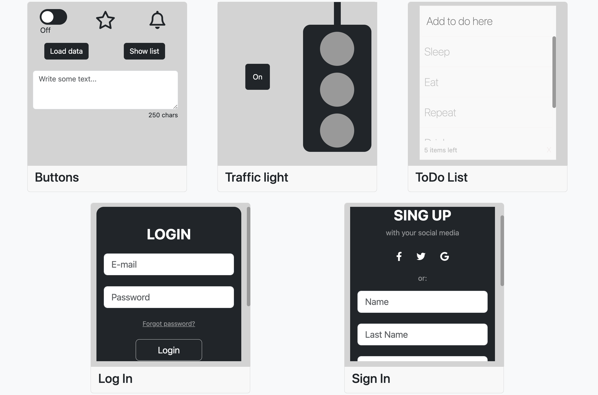

# Angular Project with Bootstrap



<p align="center">


</p>

## Description

This project is an Angular application that showcases various components implemented using Bootstrap.

## Components

### Buttons

The Buttons component showcases different styles and variations of buttons, including swipe button, favorite, notifications, text input and display, show and hide list buttons.

### Traffic Light

The Traffic Light component simulates a traffic light with three lights: red, yellow, and green. It demonstrates how to control the state of the lights.

### Todo List

The Todo List component allows users to manage their tasks by adding, updating, and deleting items from a list. It showcases how to handle user input and update the UI dynamically.

### Log In

The Log In component provides a simple form for users to log in with their credentials. It demonstrates form validation and authentication concepts.

### Sign In

The Sign In component allows new users to create an account by filling out a registration form. It showcases form validation and data submission.

## Installation

1. Clone the repository:

   ```shell
   git clone https://github.com/your-username/angular-project.git
   ```

2. Install dependencies:

   ```shell
   npm install
   ```

3. Start the development server:

   ```shell
   ng serve
   ```

4. Open your browser and visit `http://localhost:4200` to access the application.

## Technologies Used

- Angular
- Bootstrap
- TypeScript
- HTML
- CSS

## Contributing

Contributions are welcome! Please follow these guidelines:

1. Fork the repository.
2. Create a new branch.
3. Make your changes and commit them.
4. Push your changes to your forked repository.
5. Submit a pull request.
